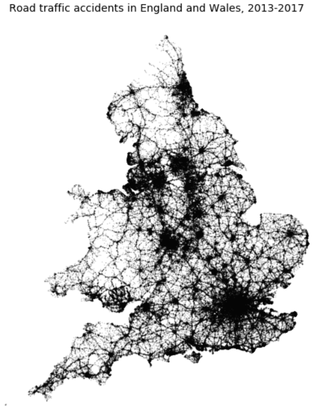
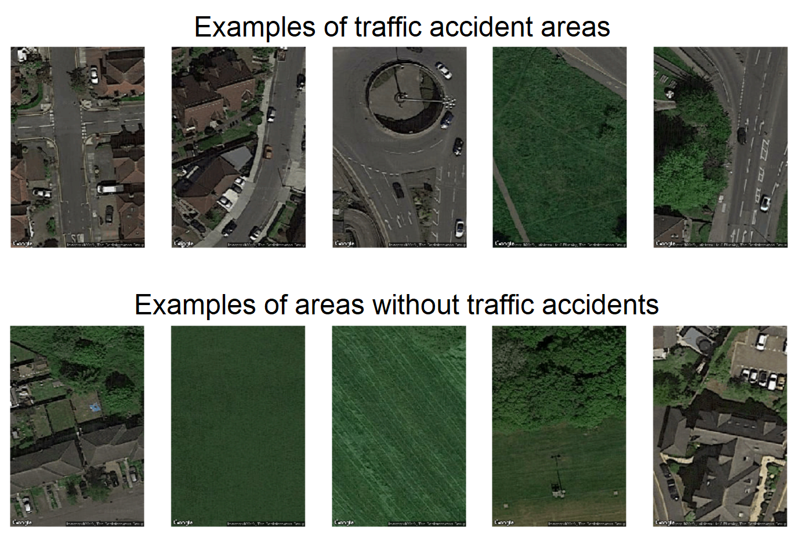
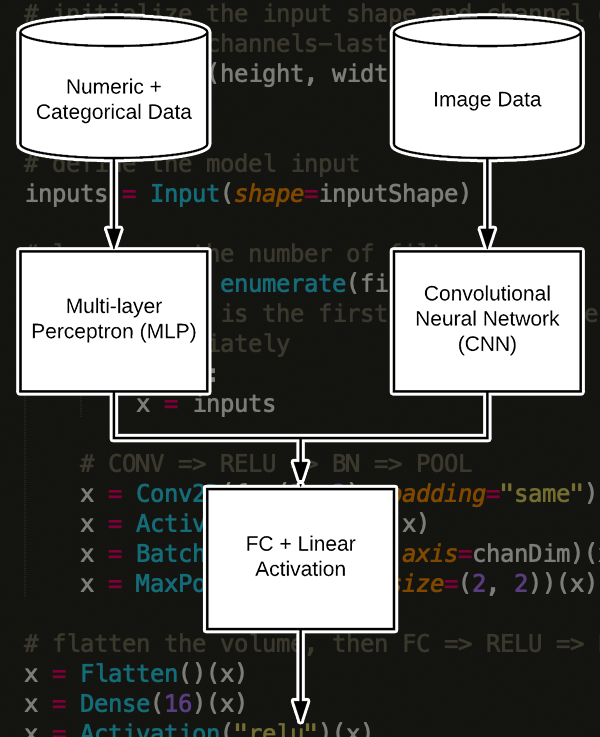
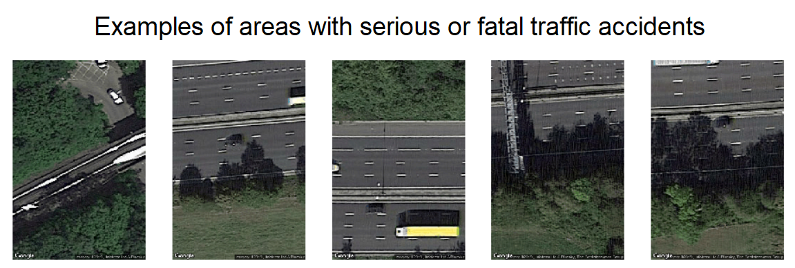

# Predicting traffic accidents with neural networks

## Project aims

Each year about 1.25 million people die in road traffic accidents, and an additional 20-50 million are injured or disabled. If the locations of traffic accidents could be predicted, this could have a huge beneficial impact in potentially helping to reduce the number of accidents each year. For example, routing software could avoid the most dangerous areas - particularly in the context of the coming advent of driverless cars. It could also be useful in an insurance context, in order to predict risk, as well as for governments and local road authorities looking to create more efficient systems of road maintenance and improvements. The aim of this project is to predict where traffic accidents are likely to occur.

## Methodology

For this problem, we didn’t want to just look at traditional structured data and machine learning models. Instead, we wanted to find out if satellite imagery could be combined with other datasets in order to increase our ability to predict where traffic accidents are likely to occur. Our methodology for this project was to make four models:

**Model 1** uses a combination of accident, population density and traffic data from the UK, where we focused on accidents in London.  Different machine learning models were built to see if the level of accident severity could be predicted.

*Map of traffic accident locations in the UK, 2013-2017*
 

**Model 2** uses satellite images of London that were scraped using Google Maps Static API and fed into a Convolutional Neural Network (CNN) in order to predict where traffic accidents are likely to occur.

*Example satellite images downloaded using the Google Maps Static API*

**Model 3** then makes use of Keras functional API to combine the top features from model 1 and the image features extracted from a CNN (similar to model 2) to create a mixed-input or mixed data model. Both data types are fed into separate deep learning models and their outputs are combined for the final layers in order to predict whether a given area is likely to have traffic accidents or not.

*Model architecture of the mixed data neural network. Source: [Pyimagesearch](https://www.pyimagesearch.com/2019/02/04/keras-multiple-inputs-and-mixed-data/)*

**Model 4** uses the same model architecture as model 3, but applies it to the task of distinguishing between areas with no traffic accidents and areas with serious or fatal traffic accidents, in order to predict the locations of the worst traffic accidents.

*Example satellite images of areas with serious or fatal accidents*

## Results

Our findings showed that being able to predict accident severity was quite difficult due to the imbalance between slight, serious, and fatal accidents (58% accuracy).  Using satellite images with a CNN model yielded strong results in predicting traffic accident locations (77% accuracy). The mixed data model had an even higher accuracy (80% for no accidents vs. any accidents, and 82% for no accidents vs. serious or fatal accidents), producing better results from combining image features with structured data. There are also several promising options to improve the model further, beyond this initial proof of concept.

Overall, we were able to demonstrate that combining satellite images with structured data can increase the predictive capacity of a model to predict the location of traffic accidents.

## Notebook structure

The following notebooks show the steps we took in order to reach these findings:

1. Cleaning the accident data

2. Cleaning the traffic and population density data, merging this with the accident data, and downloading satellite images from the Google Maps Static API

3. Exploring the geographical distribution of the data, and comparing the characteristics of accidents of different levels of severity

4. Exploring the changes in accident numbers over time, and investigating various other features of the accident dataset

5. Model 1 - predicting traffic accident severity with structured data

6. Model 2 - predicting traffic accident location from satellite imagery

7. Model 3 - predicting traffic accident location using mixed data (satellite imagery and structured data)
8. Model 4 - predicting serious and fatal traffic accident location using mixed data (satellite imagery and structured data)